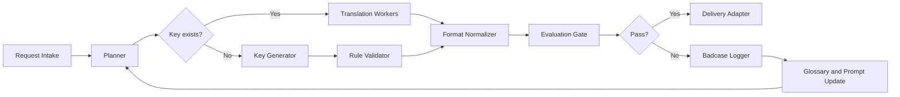

# AI i18n Delivery Workflow

面向多语言文案交付的 AI 工作流作品集。公开版展示问题拆解、系统架构、评测方法和匿名化示例，不包含真实业务数据、项目代号、内网系统、接口细节或生产记录。

## 项目展示

▶ **[查看完整项目作品集页面](https://tonghaiqi98-creator.github.io/i18n/)** （自包含单文件 HTML，含业务诊断、架构设计、评测体系、Prompt 飞轮、模型选型矩阵等完整叙事）

> 启用 GitHub Pages：Settings → Pages → Source: `main` 分支，根目录 → Save。

本地查看：在浏览器中打开 `index.html`。

## 项目概览

多语言交付的核心瓶颈：需求输入不规范、翻译质量难量化、上线前格式校验依赖人工。本项目将流程拆为 `Plan → Act → Eval → Delivery` 四段，通过可审计的规则校验与评测闭环降低返工。

核心能力：

- 自动解析需求行，识别缺失 key、占位符、字符限制和目标语种
- 缺 key 时生成命名候选，并通过规则校验约束格式
- 术语召回、翻译、文化适配和格式归一化拆为可替换 Worker
- 规则校验覆盖占位符、key 格式、长度限制和双端一致性
- 低分样本回流至术语表、Prompt 和 Golden Set
- 交付适配层对接内部平台，公开版仅保留接口边界

## 架构图



详细架构与评测闭环见 [docs/architecture.md](docs/architecture.md)。

## 公开安全边界

本仓库是作品集版本，已经做了脱敏处理：

- 不公开真实客户、公司、产品、项目代号和人员信息
- 不公开原始表格、访谈记录、生产数据、平台 URL、真实 API、认证字段或截图
- 不公开内部面试准备材料和无法展示的项目资料
- 本机私有归档位于 `_private/`，已被 `.gitignore` 排除

## 目录

```text
.
├── index.html            # 项目作品集展示页（单文件，浏览器可直接打开）
├── README.md
├── docs/
│   ├── architecture.md
│   ├── case-study.md
│   └── evaluation.md
├── examples/
│   └── sample_request.json
├── src/
│   └── i18n_portfolio/
│       ├── __init__.py
│       ├── pipeline.py
│       └── validators.py
├── tests/
│   └── test_validators.py
├── SECURITY.md
└── pyproject.toml
```

## 运行示例

```bash
PYTHONPATH=src python3 -m i18n_portfolio.pipeline examples/sample_request.json
python3 -m unittest discover -s tests
```

示例代码不会请求外部模型或真实平台，只演示工作流拆解、占位符保护、key 规则校验和可审计输出结构。

## 我负责的设计点

- 将端到端链路拆为 Planner、Workers、Evaluation Gate、Delivery Adapter
- 设计占位符与 key 命名的规则校验，优先拦截确定性错误
- 设计 golden set、stress test 和 LLM-as-a-Judge 的评测分层
- 把 badcase 从一次性修 bug 变成术语表、prompt 和测试集的持续回流
- 明确公开版和私有材料的边界，保证项目可展示但不泄露内部信息
