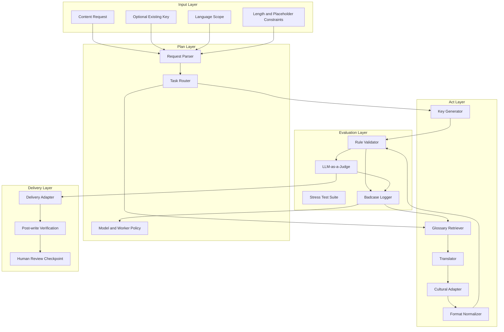
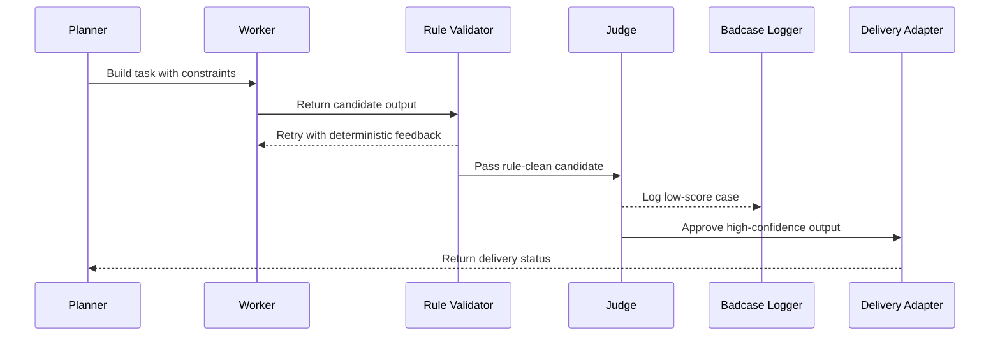
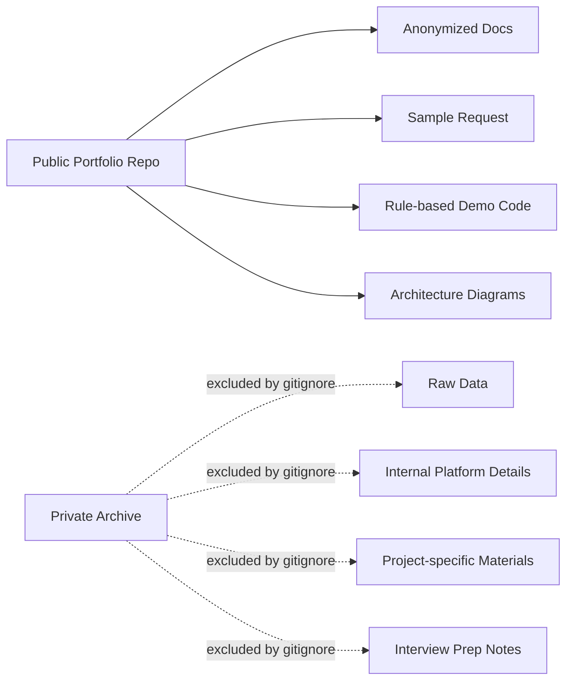

# Architecture

公开版架构保留系统设计和工程取舍，隐藏真实平台、接口、字段和业务数据。

## System View

## Why This Split

Planner 只做任务拆解和路由，不直接处理翻译质量。Workers 专注生成候选结果。Evaluation Gate 先跑确定性规则，再跑语义评测，避免用 LLM 处理占位符缺失、key 非法这类可以精确判断的问题。Delivery Adapter 被单独隔离，因为它最容易绑定具体企业平台，公开版只保留边界。

## Evaluation Flow

## Public Repository Boundary

## Main Design Decisions

| Decision | Reason |
|---|---|
| Put key generation behind Planner routing | Missing key is an input-shape problem, not a translation problem |
| Keep deterministic checks before LLM judging | Placeholders, naming format and length limits should be exact |
| Separate Delivery Adapter | Real upload logic is platform-specific and should not leak into public code |
| Keep badcase feedback as a first-class loop | Quality improves only when failures update glossary, prompt and tests |
| Publish anonymized sample code only | Portfolio value comes from architecture and judgment, not internal data exposure |
