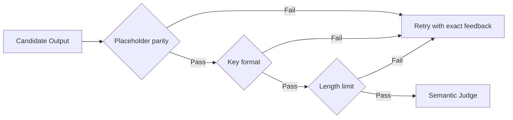

# Evaluation Design

## Layers

| Layer | Purpose | Example checks |
|---|---|---|
| Rule Validator | Catch exact failures | placeholder parity, key format, character limit |
| Golden Set | Measure known hard cases | UI buttons, error messages, onboarding copy, placeholders |
| Stress Test | Probe failure modes | placeholder deletion, glossary violation, length expansion |
| LLM-as-a-Judge | Score semantic quality | accuracy, fluency, terminology consistency |
| Badcase Logger | Close the loop | feed failures into glossary, prompts and tests |

## Rule Validator

Deterministic checks run first because they are cheaper, faster and easier to audit. A candidate output should not reach semantic judging when it already fails exact constraints.

## Golden Set

The golden set should include common and adversarial examples:

- short UI commands
- error messages with placeholders
- onboarding instructions
- text with product terminology
- strings with strict length limits
- neutral control samples

The public repository intentionally includes only anonymized examples.

## Badcase Loop

Every failed case should produce one of three updates:

- glossary update, when a business term is missing or inconsistent
- prompt update, when the model needs a clearer priority rule
- test update, when the failure should never regress again

The goal is not just to improve one output. The goal is to make the next batch safer.
